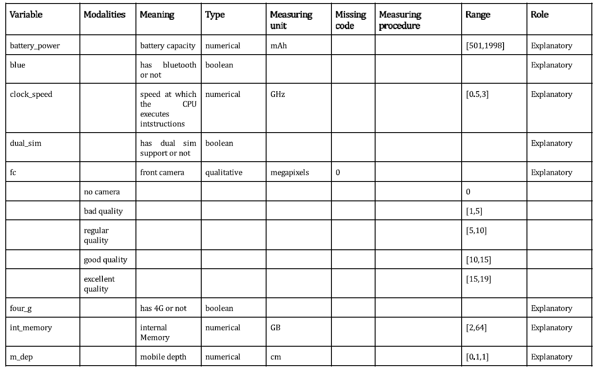
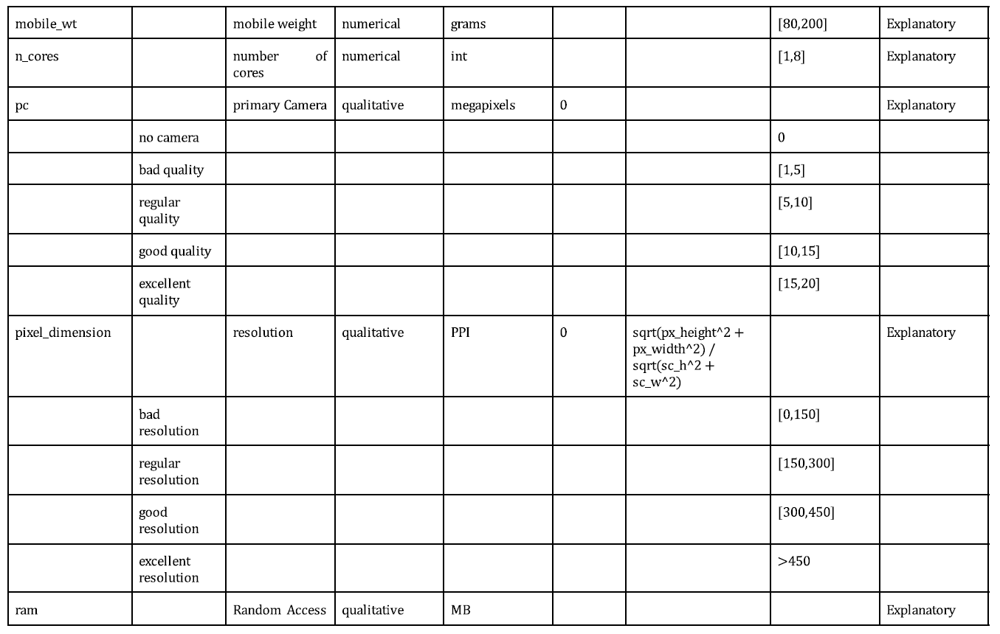
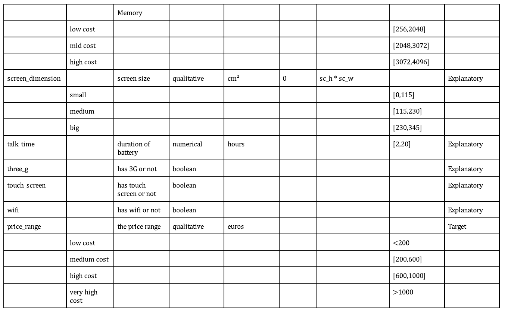
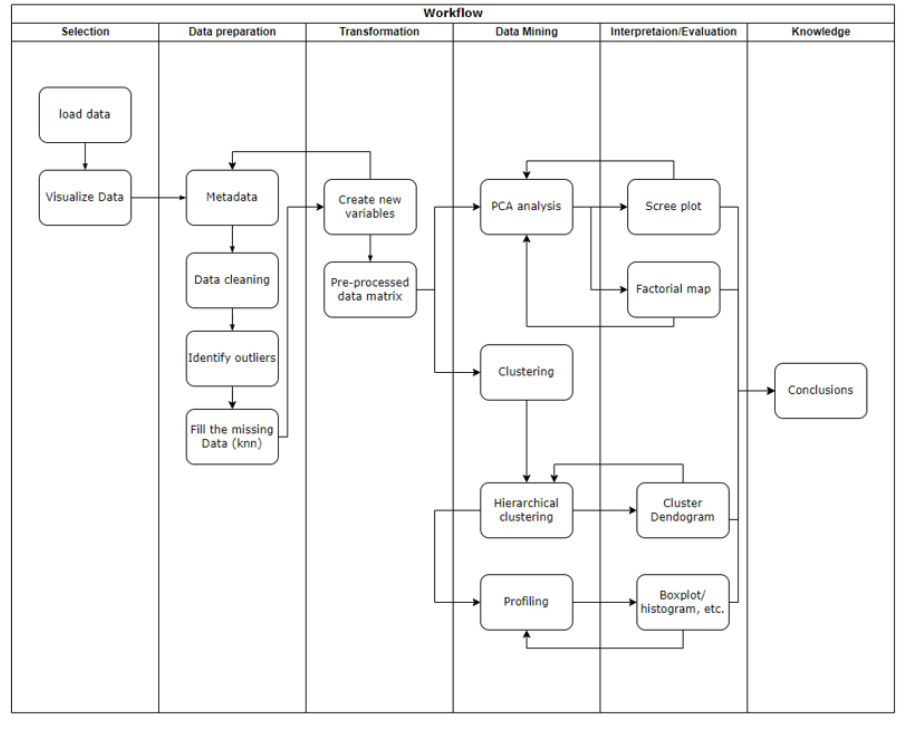

# Introduction

## Motivation of the work and description of the problem

With the augment of technological devices around us and the daily use we give them, it makes sense to be informed, or at least curious, about which device is worth buying depending on it's characteristics and, primarily, it's price. Nowadays everybody has a mobile phone it their pocket, so you must be interested in which cellphone can make the best photos, or which mobile has the most battery, or biggest screen. Since the first mobile phones, every year thousands of new models with better or worst characteristics are created, and the popular opinion seems to believe that the price of the mobile is an indicator of it's quality. Is this belief true? Can some mobiles be more expensive and have worst components than others with a lower price? 

We will try to find the relations between the characteristics and the price of the mobiles in our dataset and group them depending on their components. With all this organized information, we could check if our mobiles are overpriced or too cheap, we could see the evolution of the mobile prices and its quality, give a fair price to the new models and discard mobiles or whole brands regarding on their components and prices.

## Data source presentation

* Data source

https://www.kaggle.com/iabhishekofficial/mobile-price-classification

* How to get the data?

Through the link above, click the download button. We will only use the train.csv dataset, since it includes the categorical variable price range.

* What is data about?

All the technical features of mobile phones (screen size, resolution, camera, etc) and their corresponding selling prices. The objective is to study the relation between said features and the different price ranges.

We will create the qualitative variables screen_dimension and pixel_dimension from 4 numerical variables called sc_h (Screen Height of mobile in cm), sc_w (Screen Width of mobile in cm), px_height (Pixel Resolution Height) and px_width (Pixel Resolution Width).

We will also factorize the numerical variables pc (Primary Camera megapixels), fc (Front Camera megapixel) and ram (Random Access Memory in MegaBytes).
 
* Basic structure of data matrix:
  + nr. of records: 2000
  + nr. of variables: 19
  + nr. of numerical variables: 7 
  + nr of binary variables: 6
  + nr of qualitative variables: 6
  + number and % of missing data per variable: 390 missing values in variable screen width (19%)
  + total % missing: 0.93% 

## Load Required Packages

```{r paquets, message=FALSE, warning=FALSE}
# Clean workspace
rm(list=ls())

options(contrasts=c("contr.treatment","contr.treatment"))
requiredPackages <- c("effects","FactoMineR","car", "factoextra","RColorBrewer","ggplot2",
                      "dplyr","ggmap","ggthemes","knitr", "magrittr","class","readr","purrr","cluster")
package.check <- lapply(requiredPackages, FUN = function(x) {
  if (!require(x, character.only = TRUE)) {
    install.packages(x, dependencies = TRUE)
    library(x, character.only = TRUE)
  }
})
search()
```

## Some useful functions

```{r funcions, warning=FALSE}
# Some useful functions
calcQ <- function(x) {
  s.x <- summary(x)
  iqr<-s.x[5]-s.x[2]
  list(souti=s.x[2]-3*iqr, mouti=s.x[2]-1.5*iqr, min=s.x[1], q1=s.x[2], q2=s.x[3], 
       q3=s.x[5], max=s.x[6], mouts=s.x[5]+1.5*iqr, souts=s.x[5]+3*iqr ) }


#Calcula els valor test de la variable Xnum per totes les modalitats del factor P
ValorTestXnum <- function(Xnum,P){
  #freq dis of fac
  nk <- as.vector(table(P)); 
  n <- sum(nk); 
  #mitjanes x grups
  xk <- tapply(Xnum,P,mean);
  #valors test
  txk <- (xk-mean(Xnum))/(sd(Xnum)*sqrt((n-nk)/(n*nk))); 
  #p-values
  pxk <- pt(txk,n-1,lower.tail=F);
  for(c in 1:length(levels(as.factor(P)))){if (pxk[c]>0.5){pxk[c]<-1-pxk[c]}}
  return (pxk)
}


ValorTestXquali <- function(P,Xquali){
  taula <- table(P,Xquali);
  n <- sum(taula); 
  pk <- apply(taula,1,sum)/n;
  pj <- apply(taula,2,sum)/n;
  pf <- taula/(n*pk);
  pjm <- matrix(data=pj,nrow=dim(pf)[1],ncol=dim(pf)[2], byrow=TRUE);      
  dpf <- pf - pjm; 
  dvt <- sqrt(((1-pk)/(n*pk))%*%t(pj*(1-pj))); 
  #i hi ha divisions iguals a 0 dona NA i no funciona
  zkj <- dpf
  zkj[dpf!=0]<-dpf[dpf!=0]/dvt[dpf!=0]; 
  pzkj <- pnorm(zkj,lower.tail=F);
  for(c in 1:length(levels(as.factor(P)))){for (s in 1:length(levels(Xquali))){if (pzkj[c,s]> 0.5){pzkj[c,s]<-1- pzkj[c,s]}}}
  return (list(rowpf=pf,vtest=zkj,pval=pzkj))
}
```

## Load data

```{r load}
#set working directory
setwd("D:/Drive/UNI/Q8/MD/MD-practical_work1")
df <- read_csv("data_mobiles.csv")
names(df)

var_bin <- names(df)[c(2,4,6,18:20)]
summary(df[var_bin])
var_num <- names(df)[c(1,3,7:10,17)]
summary(df[var_num])
var_cat <- names(df)[c(5,11:16,21)]
summary(df[var_cat])

```


# Initial analisys

## Data Description

### Metadata description

Each row of the matrix contains different data about the specifications of a cell phone, the columns of these rows can be divided into 3 types; numerical, qualitative and boolean. To begin with, the numerical type variables are: 

 * "battery_power", indicates the battery capacity.
 * "clock_speed", indicates the speed at which the CPU executes the instructions.
 * "int_memory", indicates the internal memory of the device.
 * "m_dep", indicates the depth of the device.
 * "mobile_wt", indicates the weight of the device.
 * "n_cores", indicates the number of cores of the device.
 * "talk_time", indicates the device battery life.

Then the boolean variables are:
 * "blue", indicates whether the device has Bluetooth. 
 * "dual_sim", indicates if the device has support for carrying two sim cards.
 * "four_g", indicates if the device has 4G. 
 * "three_g", indicates if the device has 3G.
 * "touch_screen", indicates if the device has a touch screen.
 * "wifi", indicates if the device can connect to a wifi network.

Finally the qualitative type variables are:
 * "fc", indicates the quality of the front camera and is divided into 5 modalities depending on the number of megapixels.
 * "pc", indicates the quality of the main camera and is divided into 5 modalities depending on the number of megapixels.
 * "px_height" and "px_width" are transformed into a new variable "pixel_dimension", which indicates the pixels per inch of the device and is divided into 4 modalities depending on the PPI.
 * "ram", which indicates the RAM and is divided into 3 modalities depending on the cost of the device .
 * "sc_h" and "sc_w" are transformed into a new variable "screen_dimension", which indicates the size of the screen and is divided into 3 modalities depending on the size of the device.
 * "price range", which is divided into 4 modalities depending on the price range of the device.








### Data Mining process


At first, in the selection process,  we used a website named kaggle to download our initial data matrix and loaded it in RStudio to visualize all the variables. Next we entered in the data preparation process, in this part we made a formal metadata table in order to have a clear representation of all variables. We searched for unnecessary outliers, in our case there weren’t any, but we had missing data in the screen_width variable so we imputed it with K-Nearest-Neighbour (KNN) algorithm. 
/

After that we started the data transformation process, in our case we didn’t have enough qualitative variables so we had to transform some of the numerical ones and also modify the metadata accordingly. 
/

With our new preprocessed matrix we started the data mining and interpretation process, at first we used a factorial method named Principal Components Analysis (PCA) with our numerical variables. We applied this method to simplify the complexity of our sample spaces with many dimensions while preserving most of their information and to visualize these results we used the scree plot and the factorial map. Next we did the clustering to group the variables with similar characteristics or distance and represent it with a dendrogram. The following step was doing the profiling to generate descriptions of the clusters we calculated previously. To interpret and better understand this information we made different kinds of graphs, such as barplots, histograms, boxplots, etc.. In our workflow diagram, we have drawn return arrows from the interpretation and evaluation processes to their corresponding data mining process in case, after seeing them, something had to be modified.
/

Finally, the last step of our work was to gain the information from the scree plot and factorial map that we generated with the PCA analysis, the dendrogram we extracted from the clustering process and the different plots we made during the profiling to make our final conclusions on the project.





## Univariate descriptive statistics of raw variables


```{r}
dataset<-"data mobiles"
vars <- names(df)[c(1:21)]
colNames<-colnames(df[vars])
colors = c("#EF5350", "#EC407A", "#AB47BC", "#5C6BC0", "#42A5F5", "#26C6DA", "#26A69A", "#66BB6A", "#D4E157", "#FFEE58", "#FFA726", "#FF7043", "#8D6E63")
```

### Numerical variables

```{r}

var <- df$battery_power
cat("Minimum value: ", min(var), "\n")      # Get minimum value
cat("Maximum value: ", max(var), "\n")      # Get maximum value
cat("Mean: ", mean(var), "\n")              # Get mean
cat("Median: ", median(var), "\n")          # Get median
cat("Variance: ", var(var), "\n")           # Get variance
cat("Standard deviation: ", sd(var), "\n")  # Get standard deviation
# Get histogram 
hist(var, xlab = "battery_power", main = "Histogram of battery_power")
# Get a plot to see if follow a normal distribution
qqnorm(var); qqline(var, col = "red")

```

Here we can see that our data does not follow a normal distribution and that the frequency has its lower peaks in 1250 and 1700 and its highest at 600 and 1500 approximately.

```{r}

var <- df$clock_speed
cat("Minimum value: ", min(var), "\n")      # Get minimum value
cat("Maximum value: ", max(var), "\n")      # Get maximum value
cat("Mean: ", mean(var), "\n")              # Get mean
cat("Median: ", median(var), "\n")          # Get median
cat("Variance: ", var(var), "\n")           # Get variance
cat("Standard deviation: ", sd(var), "\n")  # Get standard deviation
# Get histogram 
hist(var, xlab = "clock_speed", main = "Histogram of clock_speed")
# Get a plot to see if follow a normal distribution
qqnorm(var); qqline(var, col = "red")

```

We can observe that it does not follow a normal distribution and the frequency barely reaches the value 200.

```{r}

var <- df$int_memory
cat("Minimum value: ", min(var), "\n")      # Get minimum value
cat("Maximum value: ", max(var), "\n")      # Get maximum value
cat("Mean: ", mean(var), "\n")              # Get mean
cat("Median: ", median(var), "\n")          # Get median
cat("Variance: ", var(var), "\n")           # Get variance
cat("Standard deviation: ", sd(var), "\n")  # Get standard deviation
# Get histogram 
hist(var, xlab = "int_memory", main = "Histogram of int_memory")
# Get a plot to see if follow a normal distribution
qqnorm(var); qqline(var, col = "red")

```

We can observe that the highest values are between 5 and 20 and on the other hand 40.

```{r}

# Age
var <- df$m_dep
cat("Minimum value: ", min(var), "\n")      # Get minimum value
cat("Maximum value: ", max(var), "\n")      # Get maximum value
cat("Mean: ", mean(var), "\n")              # Get mean
cat("Median: ", median(var), "\n")          # Get median
cat("Variance: ", var(var), "\n")           # Get variance
cat("Standard deviation: ", sd(var), "\n")  # Get standard deviation
# Get histogram 
hist(var, xlab = "m_dep", main = "Histogram of m_dep")
# Get a plot to see if follow a normal distribution
qqnorm(var); qqline(var, col = "red")

```

The values remain very low, the higher frequency is in the closest values to the axis. 

```{r}

var <- df$mobile_wt
cat("Minimum value: ", min(var), "\n")      # Get minimum value
cat("Maximum value: ", max(var), "\n")      # Get maximum value
cat("Mean: ", mean(var), "\n")              # Get mean
cat("Median: ", median(var), "\n")          # Get median
cat("Variance: ", var(var), "\n")           # Get variance
cat("Standard deviation: ", sd(var), "\n")  # Get standard deviation
# Get histogram 
hist(var, xlab = "mobile_wt", main = "Histogram of mobile_wt")
# Get a plot to see if follow a normal distribution
qqnorm(var); qqline(var, col = "red")

```

The lower frequency values are around 90 and 170 and the higher ones in 80, 100 to 110 and from 180 to 200.

```{r}

var <- df$n_cores
cat("Minimum value: ", min(var), "\n")      # Get minimum value
cat("Maximum value: ", max(var), "\n")      # Get maximum value
cat("Mean: ", mean(var), "\n")              # Get mean
cat("Median: ", median(var), "\n")          # Get median
cat("Variance: ", var(var), "\n")           # Get variance
cat("Standard deviation: ", sd(var), "\n")  # Get standard deviation
# Get histogram 
hist(var, xlab = "n_cores", main = "Histogram of n_cores")
# Get a plot to see if follow a normal distribution
qqnorm(var); qqline(var, col = "red")

```

Values are very low, the maximum is 8, we can observe gaps between values.

```{r}
var <- df$talk_time
cat("Minimum value: ", min(var), "\n")      # Get minimum value
cat("Maximum value: ", max(var), "\n")      # Get maximum value
cat("Mean: ", mean(var), "\n")              # Get mean
cat("Median: ", median(var), "\n")          # Get median
cat("Variance: ", var(var), "\n")           # Get variance
cat("Standard deviation: ", sd(var), "\n")  # Get standard deviation
# Get histogram 
hist(var, xlab = "talk_time", main = "Histogram of talk_time")
# Get a plot to see if follow a normal distribution
qqnorm(var); qqline(var, col = "red")
```

The frequency distribution is very equal, as wee can see that the mean is 11 and the maximum value is 20. The higher frequency values are from 0 to 5.

### Categorical variables

```{r}

var <- df$fc
hist(var, xlab = "fc", main = "Histogram of fc")
boxplot(df$price_range,main="Boxplot of fc")

```

The frequency decreases as the fc increases.

```{r}

var <- df$pc
hist(var, xlab = "pc", main = "Histogram of pc")
boxplot(df$price_range,main="Boxplot of pc")

```

The frequency distribution is balanced, excepting for the lower values near the axis.

```{r}

var <- df$px_height
hist(var, xlab = "px_height", main = "Histogram of px_heigth")
boxplot(df$price_range,main="Boxplot of px_height")

```

The frequency distribution decreases uniformly.

```{r}

var <- df$px_width
hist(var, xlab = "px_width", main = "Histogram of px_width")
boxplot(df$price_range,main="Boxplot of px_width")

```

The distribution remains with high values along the data.

```{r}

var <- df$ram
hist(var, xlab = "ram", main = "Histogram of ram")
boxplot(df$price_range,main="Boxplot of ram")

```

The frequency grows and from 500  remains balanced between 250 and 300.

```{r}

var <- df$sc_h
hist(var, xlab = "sc_h", main = "Histogram of sc_h")
boxplot(df$sc_h, main="Boxplot of screen height")

```

The values remain between 8 and 16, with the highest values being 12 and 16.

```{r}

var <- df$sc_w
hist(var, xlab = "sc_w", main = "Histogram of sc_w")
boxplot(df$price_range,main="Boxplot of sc_w")

```

The screen width frequency decreases and the higher values are between 0 and 5.

```{r}

var <- df$price_range
hist(var, xlab = "price_range", main = "Histogram of price_range")
boxplot(df$price_range,main="Boxplot of price range")

```

The price range distribution has very big gaps between the values.

### Binary variables

```{r}

df$blue <- factor(df$blue, labels = c("NoBth","YesBth"))
summary(df$blue)

var <- df$blue
barplot(sort(table(var), decreasing = T), col = colors[1], main="Barplot of blue");
pie(table(var), col = colors, main="Pie of blue")

```

We can see that the number of phones with bluetooth is a little bit lower than the number of phones without it.

```{r}

df$dual_sim <- factor(df$dual_sim, labels = c("No2Sim","Yes2Sim"))
summary(df$dual_sim)

var <- df$dual_sim
barplot(sort(table(var), decreasing = T), col = colors[1], main="Barplot of dual_sim");
pie(table(var), col = colors, main="Pie of dual_sim")

```

We can also see that phones with dual sim and without are very balanced.

```{r}

df$four_g <- factor(df$four_g, labels = c("No4G","Yes4G"))
summary(df$four_g)

var <- df$four_g
barplot(sort(table(var), decreasing = T), col = colors[1], main="Barplot of four_g");
pie(table(var), col = colors, main="Pie of four_g")

```

There is no big difference between the amount of phones that have and don't have 4G.

```{r}

df$three_g <- factor(df$three_g, labels = c("No3G","Yes3G"))
summary(df$three_g)

var <- df$three_g
barplot(sort(table(var), decreasing = T), col = colors[1], main="Barplot of three_g");
pie(table(var), col = colors, main="Pie of three_g")

```

We can see a great difference between phones that have and don't have 3G, we have a difference of more than 1000 units. 

```{r}

df$touch_screen <- factor(df$touch_screen, labels = c("NoTouch","YesTouch"))
summary(df$touch_screen)

var <- df$touch_screen
barplot(sort(table(var), decreasing = T), col = colors[1], main="Barplot of touch_screen");
pie(table(var), col = colors, main="Pie of touch_screen")

```

Same happens with the touch screen. The numbers of phones with touch screen are slightly higher than the ones that don't.

```{r}

df$wifi <- factor(df$wifi, labels = c("NoWifi","YesWifi"))
summary(df$wifi)

var <- df$wifi
barplot(sort(table(var), decreasing = T), col = colors[1], main="Barplot of wifi");
pie(table(var), col = colors, main="Pie of wifi")
```

We can observe that the number of phones with Wifi is a little bit higher than the ones who don't.


# Data preprocessing

Before starting to analyze and extract information from the data, we have to prepare it in order to make a correct and clean study. We need to convert the erroneous values into valid data that makes sense.

In our dataset, we happen to have some 0 values in front camera megapixels, primary camera megapixels, pixel resolution height and screen width. We will suppose that the mobiles with 0 mp in the front camera or in the main camera are mobiles that don't have a camera.

Since the observations with a 0 value in the pixel resolution height are so little we will drop those rows.
What we will do to correct the screen width values is the KNN method, so those mobile phones that have a 0 screen width are going to have a valid value based on the values of the rest of the data.

Once we have treated those values, our data should not have any more errors or missing data. Now that we cleaned the data, in order to meet project requirements, we have to transform some of the numeric variables into categorical variables.

Currently, our data has 14 numeric variables and 6 binary variables. We decided to put together the screen height and the screen width (sc_h + sc_w) into one categorical variable, Screen Dimension (sc_d), and divide the screen dimension by groups (small, medium, big). We decided to do the same for the pixel resolution (px_h + px_w), Pixel Resolution (px_r) and divide it by groups as well (small, medium, big). We chose to group those variables
because they are directly related. Then, we decided to group the primary camera megapixels (pc) and the front camera megapixels (fc) according to quality (low, medium, high) depending on whether it has more or less megapixels. And lastly, we decided to group the battery power (battery_power) according to duration (short, medium, long) depending on whether it has more or less power. We chose to make those last 3 variables categorical
because they have more market interest than the rest of the numeric variables.

After these transformations, we should get 5 categorical variables and 7 numeric variables, and all the data should be ready to start extracting information.

## Binary variables

```{r}
var_bin
```

The binary variables have already been factored while doing the univariate descriptive statistics of raw variables, but we will keep the code.

```{r binary_prep}
df$blue <- factor(df$blue, labels = c("NoBth","YesBth"))

df$dual_sim <- factor(df$dual_sim, labels = c("No2Sim","Yes2Sim"))

df$four_g <- factor(df$four_g, labels = c("No4G","Yes4G"))

df$three_g <- factor(df$three_g, labels = c("No3G","Yes3G"))

df$touch_screen <- factor(df$touch_screen, labels = c("NoTouch","YesTouch"))

df$wifi <- factor(df$wifi, labels = c("NoWifi","YesWifi"))
```

## Numerical Variables

```{r numerical_prep}
var_num
```

### Battery Power

```{r battery_prep}
summary(df$battery_power)
batNa<-which( c(is.na(df$battery_power), df$battery_power <=0, df$battery_power > 4000)) #best mobiles have this many mAh
batNa #doesn't have NA

var_out<-calcQ(df$battery_power)
batOut<-which((df$battery_power>var_out$souts)|(df$battery_power<var_out$souti))
batOut #doesn't have severe outliers
```

### Clock Speed

```{r clockspeed_prep}
summary(df$clock_speed)
clkNa<-which( c(is.na(df$clock_speed), df$clock_speed <=0, df$clock_speed > 4))
clkNa #doesn't have NA

var_out<-calcQ(df$clock_speed)
clkOut<-which((df$clock_speed>var_out$souts)|(df$clock_speed<var_out$souti))
clkOut #doesn't have severe outliers
```

### Internal Memory

```{r int_memory_prep}
summary(df$int_memory)
memNa<-which( c(is.na(df$int_memory), df$int_memory <=0, df$int_memory > 128)) 
memNa #doesn't have NA


var_out<-calcQ(df$int_memory)
memOut<-which((df$int_memory>var_out$souts)|(df$int_memory<var_out$souti))
memOut #doesn't have severe outliers
```


### Mobile Depth

```{r depth_prep}
summary(df$m_dep)
depNa<-which( c(is.na(df$m_dep), df$m_dep <=0, df$m_dep > 1)) 
depNa #doesn't have NA


var_out<-calcQ(df$m_dep)
depOut<-which((df$m_dep>var_out$souts)|(df$m_dep<var_out$souti))
depOut #doesn't have severe outliers
```

### Mobile Weigth

```{r weigth_prep}
summary(df$mobile_wt)
weigthNa<-which( c(is.na(df$mobile_wt), df$mobile_wt <=0, df$mobile_wt > 200)) 
weigthNa #doesn't have NA


var_out<-calcQ(df$mobile_wt)
weigthOut<-which((df$mobile_wt>var_out$souts)|(df$mobile_wt<var_out$souti))
weigthOut #doesn't have severe outliers
```

### Number of Cores

```{r cores_prep}
summary(df$n_cores)
coreNa<-which( c(is.na(df$n_cores), df$n_cores <=0, df$n_cores > 8)) 
coreNa #has one NA

var_out<-calcQ(df$n_cores)
coreOut<-which((df$n_cores>var_out$souts)|(df$n_cores<var_out$souti))
coreOut #doesn't have severe outliers
```

### Talk Time

```{r talktime_prep}
summary(df$talk_time)
talkNa<-which( c(is.na(df$talk_time), df$talk_time <=0, df$talk_time > 20)) 
talkNa #has one NA


var_out<-calcQ(df$talk_time)
talkOut<-which((df$talk_time>var_out$souts)|(df$talk_time<var_out$souti))
talkOut #doesn't have severe outliers
```

## Categorical Variables

```{r caterogrical_prp}
var_cat
```

### Treat missing values

```{r missing}

#we find missing values in the pixel resolution height and we drop them
length(which(df$px_height <= 0))
df<-df[-which(df$px_height <= 0),]


#we find missing values in the screen dimensions
length(which(df$sc_h == 0))
length(which(df$sc_w <= 1))

df[df$sc_w <= 1,"sc_w"] <- NaN


#knn imputation of sc_w NaN values using all the other numerical variables
dfaux<-df[,c(var_num,"fc","px_height", "px_width","ram","sc_h","price_range")]
names(dfaux)
aux1 <- dfaux[!is.na(df$sc_w),]
aux2 <- dfaux[is.na(df$sc_w),]

knn.ing = knn(aux1,aux2,df$sc_w[!is.na(c(df$sc_w))])

df$sc_w[is.na(df$sc_w)] <- as.numeric(as.character(knn.ing))

which(is.na(df$sc_w))

summary(df$sc_w)
summary(df$sc_h)
```

### Screen dimension

```{r screendim_prep}
#sc_h * sc_w = screen dimension (cm^2) into factor


df$sc_d <- df$sc_h * df$sc_w
summary(df$sc_d)
df$sc_d <- factor(cut(df$sc_d,breaks = c(0,115,230,345)))
levels(df$sc_d) <- c("small","medium","big")
summary(df$sc_d)
```

### Front camera quality

```{r frontcam_prep}
# fc into factor
summary(df$fc)
length(which(df$fc == 0)) #no tienen camara frontal
df$fc <- factor(cut(df$fc,breaks = c(-0.1,0,5,10,15,20)))
levels(df$fc) <- c("NoFrontCam","bad","regular","good","excellent")
summary(df$fc)
```

### Main camera quality 

```{r maincam_prep}
# pc into factor
summary(df$pc)
length(which(df$pc == 0)) #no tienen camara principal
df$pc <- factor(cut(df$pc,breaks = c(-0.1,0,5,10,15,21))) 
levels(df$pc) <- c("NoMainCam","bad","regular","good","excellent")
summary(df$pc)
```

### Pixel Dimension

```{r pixeldim_prep}
#sqrt(df$px_height^2 + df$px_width)/sqrt(df$sc_h^2 + df$sc_w^2) = px_r into factor


diag <- (sqrt((df$sc_h^2) + (df$sc_w^2)))
diag <- diag * 0.393700787

df$px_r <- (sqrt(((df$px_height^2) + df$px_width^2)))/ diag
summary(df$px_r)
df$px_r <- factor(cut(df$px_r,breaks = c(0,150,300,450,1500)))

levels(df$px_r) <- c("bad","regular","good","excellent")
summary(df$px_r)
```

### Ram 

```{r ram_prep}
#ram into factor
summary(df$ram)
df$ram <- factor(cut(df$ram,breaks = c(255,2048,3072,4096)))
levels(df$ram) <- c("low","mid","high")
summary(df$ram)
```

### Price range

```{r price_prep}
#price range into factor
summary(df$price_range)
df$price_range <- factor(df$price_range,labels = c("low","medium","high","very high"))
summary(df$price_range)
```


# Basic statistical descriptive analysis

... {Claudia}


\newpage
# PCA Analysis

In this section we will perform the Principal Component Analysis of the preprocessed dataset. Principal Component Analysis (PCA) is the process of computing the principal components and using them to perform a change of basis on the data. To do this, we will only use the principal components that add up to 80% of the total variance, and ignore the rest.

## Scree plot

First, we will generate a scree plot where we will see the contribution of the different factors to the total variance. This way, we will select the factors that contribute to approximately 80% of the variance and discard the rest.

The first step is to select the numerical variables of our dataset, as PCA only works with numerical variables.

```{r numerical_variables}
#Set a list of numerical variables (with no missing values)
numeriques<-which(sapply(df,is.numeric))
dcon<-df[,numeriques]
```

Then, we use the prcomp r function to get the principal components of our dataset. We use scale=TRUE in order to make all the variables range between 0 and 1, and thus make them comparable. From this components, we will be able to generate the scree plot and to select the factors we will use.

```{r prcomp}
# PRINCIPAL COMPONENT ANALYSIS OF dcon
pc1 <- prcomp(dcon, scale=TRUE)
print(pc1)
```

Printing pc1, we can see the relations of the eleven principal components to the different variables. We can also see the percentage of total inertia represented in each subspace with the following scree plot.

```{r scree_plot}
#Which percentage of the total inertia is represented in subspaces?
fviz_eig(pc1)

#Cummulated Inertia in subspaces, from first principal component to the 11th dimension subspace
percInerAccum<-100*cumsum(pc1$sdev[1:dim(dcon)[2]]^2)/dim(dcon)[2]
percInerAccum
```

It can be seen in the scree plot that with only 8 of the 11 dimensions we keep 80% of the inertia. From the relationships observed in the print of pc1, we will guess names for the different Principal Components. We think that PC1 almost certainly measures screen dimension, as px_height, px_width, sc_h and sc_w have large positive contributions on this component. PC2 can be pixel density, because px_height and px_width have positive contributions and sc_h and sc_w have negative contributions on this second component. The third component PC3 has large negative contributions from battery_power, m_dep and talk time, so it is probably measuring slimness. The fourth component PC4 has large positive contributions from int_memory, and negative contributions in n_cores, so it could be measuring something like data slowness. The fifth component PC5 has large positive contributions from clock speed and mobile_wt, it could be measuring CPU power. The sixth component PC6 could be measuring antiquity, because it has large positive contributions from m_dep and mobile_wt but large negative contributions from clock_speed and n_cores. PC7 could be measuring portability, as it has large negative contributions from m_dep. Finally, PC8 is probably measuring battery management, because it has large positive contributions from battery power but negative contributions from talk time.

## Factorial map visualisation

``` {r selection_dimensions}
# Selection of significant dimensions (keep 80% of total inertia)
nd <- 8

# Storage of the eigenvalues, eigenvectors and projections in the nd dimensions
Psi = pc1$x[,1:nd]
dim(Psi)
Psi[dim(df)[1],]
``` 

``` {r storage_labels}
# STORAGE OF LABELS FOR INDIVIDUALS AND VARIABLES
iden = row.names(dcon)
etiq = names(dcon)
ze = rep(0,length(etiq)) 
# WE WILL NEED THIS VECTOR AFTERWARDS FOR THE GRAPHICS
``` 

### Individuals projections

In this section we will analyse the individuals projection plot that we found are useful. All of the plots are found in the annex at the end of the document.
After analyzing all the plots we found that the majority of plots have no meaningful information, they are just clouds of points. The only plot where it can be seen something is the plot where axis are PC1 and PC2, screen dimension and pixel density. It makes sense that these two variables are related. 

``` {r 1_2_plot}
    eje1<-1
    eje2<-2
    
    plot(Psi[,eje1],Psi[,eje2], xlab=paste("PC",toString(1)) , ylab=paste("PC", toString(2)))
    text(Psi[,eje1],Psi[,eje2],labels=iden, cex=0.5)
    axis(side=1, pos= 0, labels = F, col="red")
    axis(side=3, pos= 0, labels = F, col="red")
    axis(side=2, pos= 0, labels = F, col="red")
    axis(side=4, pos= 0, labels = F, col="red")
```

We can see that the cloud forms a rhomboid. This makes sense because individuals with big screens are not as likely to have small resolution, so the pixel density is bigger too, but with very large screens you would need a lot of resolution to have big pixel density, so the values get smaller. On the small screen side, we can see that they are more likely to have bigger pixel density. Finally, in middle values, pixel density can be big or small.

### Common projection of numerical variables

Now, we will perform the projection of our numerical variables. Then, we will analyse these plots and talk about the ones that we find interesting. 
``` {r projection_variables}
#Projection of variables
Phi = cor(dcon,Psi)
Phi

#select your axis
for(i in 1:2) {
  for (j in (i+1):8) {
    X<-Phi[,i]
    Y<-Phi[,j]
    
    #zoom
    plot(X, Y, xlab=paste("PC",toString(i)) , ylab=paste("PC", toString(j)), type="n", xlim=c(min(X,0),max(X,0)), ylim=c(-1,1))
    axis(side=1, pos= 0, labels = F)
    axis(side=3, pos= 0, labels = F)
    axis(side=2, pos= 0, labels = F)
    axis(side=4, pos= 0, labels = F)
    arrows(ze, ze, X, Y, length = 0.07,col="blue")
    text(X,Y,labels=etiq,col="darkblue", cex=0.7)
    }
}

  X<-Phi[,3]
  Y<-Phi[,7]
  
  #zoom
  plot(X, Y, xlab=paste("PC",toString(i)) , ylab=paste("PC", toString(j)), type="n", xlim=c(min(X,0),max(X,0)), ylim=c(-1,1))
  axis(side=1, pos= 0, labels = F)
  axis(side=3, pos= 0, labels = F)
  axis(side=2, pos= 0, labels = F)
  axis(side=4, pos= 0, labels = F)
  arrows(ze, ze, X, Y, length = 0.07,col="blue")
  text(X,Y,labels=etiq,col="darkblue", cex=0.7)
```

As we can see, in all the plots that have PC1 in the x axis, variables px_width, px_height, sc_w and sc_h are very close to this axis, and are really large compared to the other variables, indicating that they are very related to screen dimension, which makes sense. A similar phenomena can be seen in plots with PC2 in the x axys, where px_height and px_width are large, really close to the axis and positive, whereas sc_h and sc_w are large, really close to the axis and negative, which again makes sense being PC2 pixel density. Moreover, in the plot with axis PC1 and PC2, these four variables are closer to PC1 than to PC2, but they make more of a diagonal between the two principal components, meaning that screen dimension and pixel density are related.

Another interesting plot is for example PC3 with PC7, where we can see that m_dep is almost 45 degrees negatively in both slimness and portability, meaning that phones that are fatter are less portable and quite obviously less slim.  

### Projection of qualitative variables

In this section, we will do the same individual projection plots as we did before, but now we will colour the dots based on the dataset's categorical variables. We will comment on some plots, the one's that we have found that have no valuable information to analyse can be found in the annex.
```{r qualitative_projection}
for(i in 2) {
  for (j in c(1,3,4,5,6,7,8)) {
    varcat<-df$sc_d
    plot(Psi[,i],Psi[,j], col = varcat, pch = 16,  xlab=paste("PC",toString(i)) , ylab=paste("PC", toString(j)),  main = "Screen Dimension")
    axis(side=1, pos= 0, labels = F, col="darkgray")
    axis(side=3, pos= 0, labels = F, col="darkgray")
    axis(side=2, pos= 0, labels = F, col="darkgray")
    axis(side=4, pos= 0, labels = F, col="darkgray")
    legend("bottomleft",levels(varcat),pch=16,col=c(1:3), cex=0.6)
    
    #select your qualitative variable
    fdic1 = tapply(Psi[,i],varcat,mean)
    fdic2 = tapply(Psi[,j],varcat,mean) 
    points(fdic1,fdic2,pch=16,col="blue")
    text(fdic1,fdic2,labels=levels(varcat),col="white", cex=0.7)
  }
}
for(i in 2) {
  for (j in c(1,3,4,5,6,7,8)) {
    varcat<-df$px_r
    plot(Psi[,i],Psi[,j], col = varcat, pch = 16,  xlab=paste("PC",toString(i)) , ylab=paste("PC", toString(j)), main = "Pixel Resolution")
    axis(side=1, pos= 0, labels = F, col="darkgray")
    axis(side=3, pos= 0, labels = F, col="darkgray")
    axis(side=2, pos= 0, labels = F, col="darkgray")
    axis(side=4, pos= 0, labels = F, col="darkgray")
    legend("bottomleft",levels(varcat),pch=16,col=c(1:4), cex=0.6)
    
    #select your qualitative variable
    fdic1 = tapply(Psi[,i],varcat,mean)
    fdic2 = tapply(Psi[,j],varcat,mean) 
    points(fdic1,fdic2,pch=16,col="blue")
    text(fdic1,fdic2,labels=levels(varcat),col="white", cex=0.7)
  }
}
```
As we can see, in the plots with PC2 pixel density as the x axis, we have a clear discretization of individuals colored with both sc_d (screen dimesion) and px_r (pixel resolution). This suggests that the pixel density name that we guessed is correct, because it makes sense that small screens (black in Screen Dimesion plots) have a bigger pixel density than big screens (green in Screen Dimension plots). Furthermore, in Pixel Resolution Plots, higher resolution devices have higher values of pixel density than lower resolution devices.

### Interpretation of relationships among variables

As we have already commented before, we see clear relationships between screen dimension and pixel density, and with slimness and portability. These relationship show that having a smaller or bigger screen impacts pixel density, and that a phone that is not very slim becomes less portable.

### Conclusions

Although we have seen some relationships, most of the variables do not seem to be very well related, especially with the individuals plots. Furthermore, the relationships found, although really clear, are not actually very useful. We have found that the dataset has a lot of values that do not really make sense, because some data seems to indicate that the mobile phones are smartphones, for example a lot of them have 3G, 4G and touchscreens, but in spite of this they have really small screens and there is a variable that is talk time and not screen time which would be more suitable for smartphones. We think that PCA does not reveal a lot of useful data as a result of this inconsistencies in the data set.


# Hierarchical Clustering 

```{r}
#dfNum <- df[var_num]
#summary(dfNum)
#dfNum <- scale(dfNum)
#summary(dfNum)

# Dissimilarity matrix
#d <- dist(dfNum, method = "euclidean")
names(df[,c(1:11,14,17:20,22:23)])

dissimMatrix <- daisy(df[,c(1:11,14,17:20,22:23)], metric = "gower", stand=TRUE)
distMatrix<-dissimMatrix^2


# Hierarchical clustering using Complete Linkage
hc1 <- hclust(distMatrix, method = "ward.D" )
# Plot the obtained dendrogram
plot(hc1, cex = 0.6, hang = -1)

# compute divisive hierarchical clustering
hc4 <- diana(df[,c(1:11,14,17:20,22:23)])

# Divise coefficient
#hc4$dc
# Dendogram of diana
pltree(hc4, cex = 0.6, hang = -1, main = "Dendrogram of diana")

# Cluster plot
clust <- cutree(hc4, k = 4)

#fviz_cluster(list(data = df[,c(1:11,14,17:23)], cluster = clust), geom="point")

```

## Precise description of the data used


## Clustering method used, metrics and aggregation criteria used


## Resulting Dendrogram


## Discuss about how to get the final number of clusters


## Table with a description of the clusters size


# Profiling of clusters

We will check which variables are significant for each cluster we got in the last section. Then we will try to find differences and similarities between clusters and which groups of individuals characterize them.

```{r}
dades<-as.data.frame(df)
K<-dim(dades)[2]
n<-dim(dades)[1]

P<-clust
nameP<-"Clustering classes"
nc<-length(levels(factor(P)))
pvalk <- matrix(data=0,nrow=nc,ncol=K, dimnames=list(levels(P),names(dades)))

```

## Numeric Variables

```{r}
paste("Anàlisi per classes de la Variable:", names(dades)[1])
      
boxplot(dades[, 1]~P, main=paste("Boxplot of", names(dades)[1], "vs", nameP ), horizontal=TRUE)

#Estadístics per groups:
for(s in levels(as.factor(P))) {print(summary(dades[P==s,1]))}


kw<-kruskal.test(dades[,1]~P)
paste("p-value Kruskal-Wallis:", kw$p.value)

pvalk[,1]<-ValorTestXnum(dades[,1], P)
#p-values ValorsTest:
print(pvalk[,1])
```

We can see in the boxplots plotted that each cluster is represented by different values of battery power. Checking the statistics by cluster groups we can appreciate the same behaviour, as the intervals of min - max values don't overlap and they have very different quartile distributions, means and medians. Doing the Kruskal-Wallis test, since our data is not normally distributed, we can reject the null hypothesis and confirm that the variable battery power presents significant differences between the cluster classes. Because of that, we will do the test-values to find the differences between the battery power mean of each class with respect to the global mean of the variable. The p-values being close to zero indicates that there are strong differences between the global mean and the mean of the cluster. We can see the visual representation with barplots in the annex.

```{r}
paste("Anàlisi per classes de la Variable:", names(dades)[3])
      
boxplot(dades[, 3]~P, main=paste("Boxplot of", names(dades)[3], "vs", nameP ), horizontal=TRUE)

#Estadístics per groups:
for(s in levels(as.factor(P))) {print(summary(dades[P==s,3]))}

kw<-kruskal.test(dades[,3]~P)
paste("p-value Kruskal-Wallis:", kw$p.value)
```

Analysing the clock speed variable we can see that it doesn't seems to be a variable that explains the clusters. The boxplots and the group statistics show that all the groups have the same quartile distribution, with just changing a little bit the mean and the median. To do a final test, we check that the p-value is not low enough so it's not a significant statistic.

```{r}
paste("Anàlisi per classes de la Variable:", names(dades)[7])
      
boxplot(dades[, 7]~P, main=paste("Boxplot of", names(dades)[7], "vs", nameP ), horizontal=TRUE)

#Estadístics per groups:
for(s in levels(as.factor(P))) {print(summary(dades[P==s,7]))}

kw<-kruskal.test(dades[,7]~P)
paste("p-value Kruskal-Wallis:", kw$p.value)
```

We can find a similar behaviours as the previous variable with the internal memory variable. The quartiles are similar distributed, with the same minimum and maximum values and almost the same median. The p-value of the Kruskall-Wallis test is a little bit lower than before, but not enough to be considered significant.

```{r}
paste("Anàlisi per classes de la Variable:", names(dades)[8])
      
boxplot(dades[, 8]~P, main=paste("Boxplot of", names(dades)[8], "vs", nameP ), horizontal=TRUE)

#Estadístics per groups:
for(s in levels(as.factor(P))) {print(summary(dades[P==s,8]))}

kw<-kruskal.test(dades[,8]~P)
paste("p-value Kruskal-Wallis:", kw$p.value)
```

With the mobile depth variable we see a different quartile distribution, even though the intervals are still overlapping between themselves. In this case, the median is exactly the same for all 4 groups, but the quartiles of group 1 and 4 are wider than the others. To check if this group distribution is significant enough to explain the different groups we do the Kruskal-Wallis test, which shows that is not, although is smaller than the two previous variables.

```{r}
paste("Anàlisi per classes de la Variable:", names(dades)[9])
      
boxplot(dades[, 9]~P, main=paste("Boxplot of", names(dades)[9], "vs", nameP ), horizontal=TRUE)

#Estadístics per groups:
for(s in levels(as.factor(P))) {print(summary(dades[P==s,9]))}

kw<-kruskal.test(dades[,9]~P)
paste("p-value Kruskal-Wallis:", kw$p.value)

pvalk[,9]<-ValorTestXnum(dades[,9], P)
#p-values ValorsTest:
print(pvalk[,9])
```

With the mobile weight can see, again, that this variable is similar distributed in all the clusters, so it doesn't seems to be a explanatory variable for the cluster division. Doing the Kruskal-Wallis test we confirm our thoughts, despite the fact that the p-value is very low. Doing the test value just in case we find that only the last group has the enough difference between its median of the weight variable in comparison whit the global mean of the variable.

```{r}
paste("Anàlisi per classes de la Variable:", names(dades)[10])
      
boxplot(dades[, 10]~P, main=paste("Boxplot of", names(dades)[10], "vs", nameP ), horizontal=TRUE)

#Estadístics per groups:
for(s in levels(as.factor(P))) {print(summary(dades[P==s,10]))}

kw<-kruskal.test(dades[,10]~P)
paste("p-value Kruskal-Wallis:", kw$p.value)
```

We see that the distribution of the variable number of cores is a bit different for each cluster, the 4th and the 1st cluster above all. All groups have the same median except the 1st one, and the 2nd and 3rd ones are almost the same. Because of that, the Kruskal-Wallis test shows that this variable is not representative of the clusters.

```{r}
paste("Anàlisi per classes de la Variable:", names(dades)[17])
      
boxplot(dades[, 17]~P, main=paste("Boxplot of", names(dades)[17], "vs", nameP ), horizontal=TRUE)

#Estadístics per groups:
for(s in levels(as.factor(P))) {print(summary(dades[P==s,17]))}

kw<-kruskal.test(dades[,17]~P)
paste("p-value Kruskal-Wallis:", kw$p.value)
```

The last numerical variable is the talk time of the phones. This variable shows the same quartile distributions for all groups, with the same means except for the 1st group and a very similar value of the 1st and 3rd quartile. The p-value of the Kruskal-Wallis test is not signficant enought to consider this variables as a group representative.


## Binary Variables

```{r}
print(paste("Variable", names(dades)[2]))
#Cross-table
table<-table(P,dades[,2])
table
rowperc<-prop.table(table,1)
rowperc

#diagrames de barres apilades                                         
paleta<-rainbow(length(levels(dades[,2])))
barplot(table(dades[,2], as.factor(P)), beside=FALSE,col=paleta )
legend("topright",levels(as.factor(dades[,2])),pch=1,cex=0.5, col=paleta)

print("Test Chi quadrat: ")
print(chisq.test(dades[,2], as.factor(P)))
```

The first binary variable we will check is the Bluetooth Yes/No variable. As we can see if we do the contingency table and the proportions by group, the variable is distributed equitably for all 4 groups, so it doesn't seems to explain any group in particular. The stacked bars shows a similar distributions within the clusters, which is confirmed by the Chi-Squared test. Since the p-value is not low enough to be significant, we can confirm that the clusters and the variable are not dependant. The proportions by category and the attached bars barplot can be found in the annex.

```{r}
print(paste("Variable", names(dades)[4]))
#Cross-table
table<-table(P,dades[,4])
table
rowperc<-prop.table(table,1)
rowperc

#diagrames de barres apilades                                         
paleta<-rainbow(length(levels(dades[,4])))
barplot(table(dades[,4], as.factor(P)), beside=FALSE,col=paleta )
legend("topright",levels(as.factor(dades[,4])),pch=1,cex=0.5, col=paleta)

print("Test Chi quadrat: ")
print(chisq.test(dades[,4], as.factor(P)))
```

As we have seen in the first binary variable, the Dual Sim variable also has a similar distribution in all groups, as the contingency table shows. The only group with a little difference is the first one, given that more mobiles with Dual Sim fall into that group. The Chi-Squared test confirms our thoughts, the p-values in not significant enough to consider this variable as an explanatory for the chosen clusters.

```{r}
print(paste("Variable", names(dades)[6]))
#Cross-table
table<-table(P,dades[,6])
table
rowperc<-prop.table(table,1)
rowperc

#diagrames de barres apilades                                         
paleta<-rainbow(length(levels(dades[,6])))
barplot(table(dades[,6], as.factor(P)), beside=FALSE,col=paleta )
legend("topright",levels(as.factor(dades[,6])),pch=1,cex=0.5, col=paleta)

print("Test Chi quadrat: ")
print(chisq.test(dades[,6], as.factor(P)))
```

The 4G Yes/No variable seems to have a uneven distribution in comparison with the other variables we checked. The third and fourth groups have more mobiles with 4G. The Chi-Squared test gives us a p-value even higher than the Dual Sim variable, so this variable is also not accepted as a explanatory variable for the groups.


```{r}
print(paste("Variable", names(dades)[18]))
#Cross-table
table<-table(P,dades[,18])
table
rowperc<-prop.table(table,1)
rowperc

#diagrames de barres apilades                                         
paleta<-rainbow(length(levels(dades[,18])))
barplot(table(dades[,18], as.factor(P)), beside=FALSE,col=paleta )
legend("topright",levels(as.factor(dades[,18])),pch=1,cex=0.5, col=paleta)

print("Test Chi quadrat: ")
print(chisq.test(dades[,18], as.factor(P)))
```

Seeing the contingency table and the proportions by group we can see that the 3G binary variable has a special distribution. Even though all groups have similar proportions, those proportions are not close to 50-50 as we have seen in the previous binary variables. All the groups have approximately 75% of mobiles with 3G and 25% of mobiles without them, which is obvious since this variable is very unbalanced. The p-value of the Chi-Squared test, again, confirms that this variable doesn't present significant differences between the clusters.

```{r}
print(paste("Variable", names(dades)[19]))
#Cross-table
table<-table(P,dades[,19])
table
rowperc<-prop.table(table,1)
rowperc

#diagrames de barres apilades                                         
paleta<-rainbow(length(levels(dades[,19])))
barplot(table(dades[,19], as.factor(P)), beside=FALSE,col=paleta )
legend("topright",levels(as.factor(dades[,19])),pch=1,cex=0.5, col=paleta)

print("Test Chi quadrat: ")
print(chisq.test(dades[,19], as.factor(P)))
```

We find a similar distribution with the first binary variables we checked and the Touch Screen variable. Again, the distribution is the same for all the classes and the Chi-Squared Test confirms that this variable is not important to describe the groups.

```{r}
print(paste("Variable", names(dades)[20]))
#Cross-table
table<-table(P,dades[,20])
table
rowperc<-prop.table(table,1)
rowperc

#diagrames de barres apilades                                         
paleta<-rainbow(length(levels(dades[,20])))
barplot(table(dades[,20], as.factor(P)), beside=FALSE,col=paleta )
legend("topright",levels(as.factor(dades[,20])),pch=1,cex=0.5, col=paleta)

print("Test Chi quadrat: ")
print(chisq.test(dades[,20], as.factor(P)))
```

The last binary variable we are going to analyse is the WiFi variable. The first and last cluster seem to have more mobiles with WiFi that the other groups in proportion, but not enough to be significant to represent them.

## Categorical Variables

```{r}
print(paste("Variable", names(dades)[5]))
#Cross-table
table<-table(P,dades[,5])
table
rowperc<-prop.table(table,1)
rowperc
#diagrames de barres apilades                                         
paleta<-rainbow(length(levels(dades[,5])))
barplot(table(dades[,5], as.factor(P)), beside=FALSE,col=paleta )
legend("topright",levels(as.factor(dades[,5])),pch=1,cex=0.5, col=paleta)

print("Test Chi quadrat: ")
print(chisq.test(dades[,5], as.factor(P)))
```


```{r}
print(paste("Variable", names(dades)[11]))
#Cross-table
table<-table(P,dades[,11])
table
rowperc<-prop.table(table,1)
rowperc
#diagrames de barres apilades                                         
paleta<-rainbow(length(levels(dades[,11])))
barplot(table(dades[,11], as.factor(P)), beside=FALSE,col=paleta )
legend("topright",levels(as.factor(dades[,11])),pch=1,cex=0.5, col=paleta)

print("Test Chi quadrat: ")
print(chisq.test(dades[,11], as.factor(P)))
```


```{r}
print(paste("Variable", names(dades)[14]))
#Cross-table
table<-table(P,dades[,14])
table
rowperc<-prop.table(table,1)
rowperc
#diagrames de barres apilades                                         
paleta<-rainbow(length(levels(dades[,14])))
barplot(table(dades[,14], as.factor(P)), beside=FALSE,col=paleta )
legend("topright",levels(as.factor(dades[,14])),pch=1,cex=0.5, col=paleta)

print("Test Chi quadrat: ")
print(chisq.test(dades[,14], as.factor(P))) 

###relevant variable
```


```{r}
print(paste("Variable", names(dades)[21]))
#Cross-table
table<-table(P,dades[,21])
table
rowperc<-prop.table(table,1)
rowperc
#diagrames de barres apilades                                         
paleta<-rainbow(length(levels(dades[,21])))
barplot(table(dades[,21], as.factor(P)), beside=FALSE,col=paleta )
legend("topright",levels(as.factor(dades[,21])),pch=1,cex=0.5, col=paleta)

print("Test Chi quadrat: ")
print(chisq.test(dades[,21], as.factor(P)))

###relevant variable
```


```{r}
print(paste("Variable", names(dades)[22]))
#Cross-table
table<-table(P,dades[,22])
table
rowperc<-prop.table(table,1)
rowperc
#diagrames de barres apilades                                         
paleta<-rainbow(length(levels(dades[,22])))
barplot(table(dades[,22], as.factor(P)), beside=FALSE,col=paleta )
legend("topright",levels(as.factor(dades[,22])),pch=1,cex=0.5, col=paleta)

print("Test Chi quadrat: ")
print(chisq.test(dades[,22], as.factor(P)))
```


```{r}
print(paste("Variable", names(dades)[23]))
#Cross-table
table<-table(P,dades[,23])
table
rowperc<-prop.table(table,1)
rowperc
#diagrames de barres apilades                                         
paleta<-rainbow(length(levels(dades[,23])))
barplot(table(dades[,23], as.factor(P)), beside=FALSE,col=paleta )
legend("topright",levels(as.factor(dades[,23])),pch=1,cex=0.5, col=paleta)

print("Test Chi quadrat: ")
print(chisq.test(dades[,23], as.factor(P)))
```


```{r}
##si son significatives: vvvvvvvvvvvvvvvvvvvv


#from next plots, select one of them according to your practical case
print("valorsTest:")
print( ValorTestXquali(P,dades[,2]))

   
marg <- table(as.factor(P))/n

#with legend
plot(marg,type="l",ylim=c(0,1),main=paste("Prop. of pos & neg by",names(dades)[2]))
paleta<-rainbow(length(levels(dades[,2])))
for(c in 1:length(levels(dades[,2]))){lines(colperc[,c],col=paleta[c]) }
legend("topright", levels(dades[,2]), col=paleta, lty=2, cex=0.6)
     
      #condicionades a classes
      #with legend
      plot(marg,type="n",ylim=c(0,1),main=paste("Prop. of pos & neg by",names(dades)[2]))
      paleta<-rainbow(length(levels(dades[,2])))
      for(c in 1:length(levels(dades[,2]))){lines(rowperc[,c],col=paleta[c]) }
      legend("topright", levels(dades[,2]), col=paleta, lty=2, cex=0.6)
     
      
      #amb variable en eix d'abcisses
      marg <-table(dades[,2])/n
      print(append("Categories=",levels(dades[,2])))
      plot(marg,type="l",ylim=c(0,1),main=paste("Prop. of pos & neg by",names(dades)[2]), las=3)
      paleta<-rainbow(length(levels(as.factor(P))))
      for(c in 1:length(levels(as.factor(P)))){lines(rowperc[c,],col=paleta[c]) }
      legend("topright", levels(as.factor(P)), col=paleta, lty=2, cex=0.6)
     
      
      #condicionades a columna 
      plot(marg,type="n",ylim=c(0,1),main=paste("Prop. of pos & neg by",names(dades)[2]), las=3)
      paleta<-rainbow(length(levels(as.factor(P))))
      for(c in 1:length(levels(as.factor(P)))){lines(colperc[c,],col=paleta[c]) }
      legend("topright", levels(as.factor(P)), col=paleta, lty=2, cex=0.6)
```

## Classes' interpretation

...{Joan}

# Global discussions and general conclusions


... {Joan H.}


# Working plan

## Gantt's diagram 


## Task assigment grid


## Deviances of final scheduling with respect to the original

...

## Risk contingency plan


...


\newpage

# Annex

## Individuals projections

``` {r individuals_plot}
# PLOT OF INDIVIDUALS
for(i in 1:7) {
  for (j in (i+1):8) {
    eje1<-i
    eje2<-j
    
    plot(Psi[,eje1],Psi[,eje2], xlab=paste("PC",toString(i)) , ylab=paste("PC", toString(j)))
    text(Psi[,eje1],Psi[,eje2],labels=iden, cex=0.5)
    axis(side=1, pos= 0, labels = F, col="red")
    axis(side=3, pos= 0, labels = F, col="red")
    axis(side=2, pos= 0, labels = F, col="red")
    axis(side=4, pos= 0, labels = F, col="red")
  }
}

```

## Common projection of numerical variables

``` {r projection_variables_annex}
#Projection of variables
Phi = cor(dcon,Psi)
Phi

#select your axis
for(i in 1:7) {
  for (j in (i+1):8) {
    X<-Phi[,i]
    Y<-Phi[,j]
    
    #zoom
    plot(X, Y, xlab=paste("PC",toString(i)) , ylab=paste("PC", toString(j)), type="n", xlim=c(min(X,0),max(X,0)), ylim=c(-1,1))
    axis(side=1, pos= 0, labels = F)
    axis(side=3, pos= 0, labels = F)
    axis(side=2, pos= 0, labels = F)
    axis(side=4, pos= 0, labels = F)
    arrows(ze, ze, X, Y, length = 0.07,col="blue")
    text(X,Y,labels=etiq,col="darkblue", cex=0.7)
    }
}
```

## Categorical variables projection

# PROJECTION OF ILLUSTRATIVE qualitative variables on individuals' map

```{r categ_annex}
for(i in 1:7) {
  for (j in (i+1):8) {
    varcat<-df$px_r
    plot(Psi[,i],Psi[,j], col = varcat, pch = 16,  xlab=paste("PC",toString(i)) , ylab=paste("PC", toString(j)))
    axis(side=1, pos= 0, labels = F, col="darkgray")
    axis(side=3, pos= 0, labels = F, col="darkgray")
    axis(side=2, pos= 0, labels = F, col="darkgray")
    axis(side=4, pos= 0, labels = F, col="darkgray")
    legend("bottomleft",levels(varcat),pch=16,col=c(1:4), cex=0.6)
    
    #select your qualitative variable
    fdic1 = tapply(Psi[,i],varcat,mean)
    fdic2 = tapply(Psi[,j],varcat,mean) 
    points(fdic1,fdic2,pch=16,col="blue")
    text(fdic1,fdic2,labels=levels(varcat),col="white", cex=0.7)
  }
}

for(i in 1:7) {
  for (j in (i+1):8) {
    varcat<-df$sc_d
    plot(Psi[,i],Psi[,j], col = varcat, pch = 16,  xlab=paste("PC",toString(i)) , ylab=paste("PC", toString(j)))
    axis(side=1, pos= 0, labels = F, col="darkgray")
    axis(side=3, pos= 0, labels = F, col="darkgray")
    axis(side=2, pos= 0, labels = F, col="darkgray")
    axis(side=4, pos= 0, labels = F, col="darkgray")
    legend("bottomleft",levels(varcat),pch=16,col=c(1:3), cex=0.6)
    
    #select your qualitative variable
    fdic1 = tapply(Psi[,i],varcat,mean)
    fdic2 = tapply(Psi[,j],varcat,mean) 
    points(fdic1,fdic2,pch=16,col="blue")
    text(fdic1,fdic2,labels=levels(varcat),col="white", cex=0.7)
  }
}

for(i in 1:7) {
  for (j in (i+1):8) {
    varcat<-df$price_range
    plot(Psi[,i],Psi[,j], col = varcat, pch = 16,  xlab=paste("PC",toString(i)) , ylab=paste("PC", toString(j)))
    axis(side=1, pos= 0, labels = F, col="darkgray")
    axis(side=3, pos= 0, labels = F, col="darkgray")
    axis(side=2, pos= 0, labels = F, col="darkgray")
    axis(side=4, pos= 0, labels = F, col="darkgray")
    legend("bottomleft",levels(varcat),pch=16,col=c(1:4), cex=0.6)
    
    #select your qualitative variable
    fdic1 = tapply(Psi[,i],varcat,mean)
    fdic2 = tapply(Psi[,j],varcat,mean) 
    points(fdic1,fdic2,pch=16,col="blue")
    text(fdic1,fdic2,labels=levels(varcat),col="white", cex=0.7)
  }
}

for(i in 1:7) {
  for (j in (i+1):8) {
    varcat<-df$wifi
    plot(Psi[,i],Psi[,j], col = varcat, pch = 16,  xlab=paste("PC",toString(i)) , ylab=paste("PC", toString(j)))
    axis(side=1, pos= 0, labels = F, col="darkgray")
    axis(side=3, pos= 0, labels = F, col="darkgray")
    axis(side=2, pos= 0, labels = F, col="darkgray")
    axis(side=4, pos= 0, labels = F, col="darkgray")
    legend("bottomleft",levels(varcat),pch=16,col=c(1:2), cex=0.6)
    
    #select your qualitative variable
    fdic1 = tapply(Psi[,i],varcat,mean)
    fdic2 = tapply(Psi[,j],varcat,mean) 
    points(fdic1,fdic2,pch=16,col="blue")
    text(fdic1,fdic2,labels=levels(varcat),col="white", cex=0.7)
  }
}

for(i in 1:7) {
  for (j in (i+1):8) {
    varcat<-df$touch_screen
    plot(Psi[,i],Psi[,j], col = varcat, pch = 16,  xlab=paste("PC",toString(i)) , ylab=paste("PC", toString(j)))
    axis(side=1, pos= 0, labels = F, col="darkgray")
    axis(side=3, pos= 0, labels = F, col="darkgray")
    axis(side=2, pos= 0, labels = F, col="darkgray")
    axis(side=4, pos= 0, labels = F, col="darkgray")
    legend("bottomleft",levels(varcat),pch=16,col=c(1:2), cex=0.6)
    
    #select your qualitative variable
    fdic1 = tapply(Psi[,i],varcat,mean)
    fdic2 = tapply(Psi[,j],varcat,mean) 
    points(fdic1,fdic2,pch=16,col="blue")
    text(fdic1,fdic2,labels=levels(varcat),col="white", cex=0.7)
  }
}

for(i in 1:7) {
  for (j in (i+1):8) {
    varcat<-df$three_g
    plot(Psi[,i],Psi[,j], col = varcat, pch = 16,  xlab=paste("PC",toString(i)) , ylab=paste("PC", toString(j)))
    axis(side=1, pos= 0, labels = F, col="darkgray")
    axis(side=3, pos= 0, labels = F, col="darkgray")
    axis(side=2, pos= 0, labels = F, col="darkgray")
    axis(side=4, pos= 0, labels = F, col="darkgray")
    legend("bottomleft",levels(varcat),pch=16,col=c(1:2), cex=0.6)
    
    #select your qualitative variable
    fdic1 = tapply(Psi[,i],varcat,mean)
    fdic2 = tapply(Psi[,j],varcat,mean) 
    points(fdic1,fdic2,pch=16,col="blue")
    text(fdic1,fdic2,labels=levels(varcat),col="white", cex=0.7)
  }
}

for(i in 1:7) {
  for (j in (i+1):8) {
    varcat<-df$ram
    plot(Psi[,i],Psi[,j], col = varcat, pch = 16,  xlab=paste("PC",toString(i)) , ylab=paste("PC", toString(j)))
    axis(side=1, pos= 0, labels = F, col="darkgray")
    axis(side=3, pos= 0, labels = F, col="darkgray")
    axis(side=2, pos= 0, labels = F, col="darkgray")
    axis(side=4, pos= 0, labels = F, col="darkgray")
    legend("bottomleft",levels(varcat),pch=16,col=c(1:3), cex=0.6)
    
    #select your qualitative variable
    fdic1 = tapply(Psi[,i],varcat,mean)
    fdic2 = tapply(Psi[,j],varcat,mean) 
    points(fdic1,fdic2,pch=16,col="blue")
    text(fdic1,fdic2,labels=levels(varcat),col="white", cex=0.7)
  }
}

for(i in 1:7) {
  for (j in (i+1):8) {
    varcat<-df$pc
    plot(Psi[,i],Psi[,j], col = varcat, pch = 16,  xlab=paste("PC",toString(i)) , ylab=paste("PC", toString(j)))
    axis(side=1, pos= 0, labels = F, col="darkgray")
    axis(side=3, pos= 0, labels = F, col="darkgray")
    axis(side=2, pos= 0, labels = F, col="darkgray")
    axis(side=4, pos= 0, labels = F, col="darkgray")
    legend("bottomleft",levels(varcat),pch=16,col=c(1:5), cex=0.6)
    
    #select your qualitative variable
    fdic1 = tapply(Psi[,i],varcat,mean)
    fdic2 = tapply(Psi[,j],varcat,mean) 
    points(fdic1,fdic2,pch=16,col="blue")
    text(fdic1,fdic2,labels=levels(varcat),col="white", cex=0.7)
  }
}

for(i in 1:7) {
  for (j in (i+1):8) {
    varcat<-df$four_g
    plot(Psi[,i],Psi[,j], col = varcat, pch = 16,  xlab=paste("PC",toString(i)) , ylab=paste("PC", toString(j)))
    axis(side=1, pos= 0, labels = F, col="darkgray")
    axis(side=3, pos= 0, labels = F, col="darkgray")
    axis(side=2, pos= 0, labels = F, col="darkgray")
    axis(side=4, pos= 0, labels = F, col="darkgray")
    legend("bottomleft",levels(varcat),pch=16,col=c(1:2), cex=0.6)
    
    #select your qualitative variable
    fdic1 = tapply(Psi[,i],varcat,mean)
    fdic2 = tapply(Psi[,j],varcat,mean) 
    points(fdic1,fdic2,pch=16,col="blue")
    text(fdic1,fdic2,labels=levels(varcat),col="white", cex=0.7)
  }
}

for(i in 1:7) {
  for (j in (i+1):8) {
    varcat<-df$fc
    plot(Psi[,i],Psi[,j], col = varcat, pch = 16,  xlab=paste("PC",toString(i)) , ylab=paste("PC", toString(j)))
    axis(side=1, pos= 0, labels = F, col="darkgray")
    axis(side=3, pos= 0, labels = F, col="darkgray")
    axis(side=2, pos= 0, labels = F, col="darkgray")
    axis(side=4, pos= 0, labels = F, col="darkgray")
    legend("bottomleft",levels(varcat),pch=16,col=c(1:5), cex=0.6)
    
    #select your qualitative variable
    fdic1 = tapply(Psi[,i],varcat,mean)
    fdic2 = tapply(Psi[,j],varcat,mean) 
    points(fdic1,fdic2,pch=16,col="blue")
    text(fdic1,fdic2,labels=levels(varcat),col="white", cex=0.7)
  }
}

for(i in 1:7) {
  for (j in (i+1):8) {
    varcat<-df$dual_sim
    plot(Psi[,i],Psi[,j], col = varcat, pch = 16,  xlab=paste("PC",toString(i)) , ylab=paste("PC", toString(j)))
    axis(side=1, pos= 0, labels = F, col="darkgray")
    axis(side=3, pos= 0, labels = F, col="darkgray")
    axis(side=2, pos= 0, labels = F, col="darkgray")
    axis(side=4, pos= 0, labels = F, col="darkgray")
    legend("bottomleft",levels(varcat),pch=16,col=c(1:2), cex=0.6)
    
    #select your qualitative variable
    fdic1 = tapply(Psi[,i],varcat,mean)
    fdic2 = tapply(Psi[,j],varcat,mean) 
    points(fdic1,fdic2,pch=16,col="blue")
    text(fdic1,fdic2,labels=levels(varcat),col="white", cex=0.7)
  }
}

for(i in 1:7) {
  for (j in (i+1):8) {
    varcat<-df$blue
    plot(Psi[,i],Psi[,j], col = varcat, pch = 16,  xlab=paste("PC",toString(i)) , ylab=paste("PC", toString(j)))
    axis(side=1, pos= 0, labels = F, col="darkgray")
    axis(side=3, pos= 0, labels = F, col="darkgray")
    axis(side=2, pos= 0, labels = F, col="darkgray")
    axis(side=4, pos= 0, labels = F, col="darkgray")
    legend("bottomleft",levels(varcat),pch=16,col=c(1:2), cex=0.6)
    
    #select your qualitative variable
    fdic1 = tapply(Psi[,i],varcat,mean)
    fdic2 = tapply(Psi[,j],varcat,mean) 
    points(fdic1,fdic2,pch=16,col="blue")
    text(fdic1,fdic2,labels=levels(varcat),col="white", cex=0.7)
  }
}
```

## Profiling plots

```{r}
for(k in 1:K){
  print(paste("Variable", names(dades)[k]))
  if (is.numeric(dades[,k])){
      barplot(tapply(dades[[k]], P, mean),main=paste("Means of", names(dades)[k], "by", nameP ))
      abline(h=mean(dades[[k]]))
      legend(0,mean(dades[[k]]),"global mean",bty="n")
      
  } else{
      table<-table(P,dades[,k])
      colperc<-prop.table(table,2)
      colperc
      
      #diagrames de barres adosades
      barplot(table(dades[,k], as.factor(P)), beside=TRUE,col=paleta )
      legend("topright",levels(as.factor(dades[,k])),pch=1,cex=0.5, col=paleta)
      
  }
}
```

# Bibliography

https://www.multioferta.es/smartphones-financiados/preguntas-frecuentes/caracteristicas-moviles-gama-alta-media-baja-30.html 

https://androidayuda.com/ca/como-calcular-la-densidad-de-pixeles-ppi-de-una-pantalla/ 

https://norfipc.com/celulares/medidas-pantalla-resolucion-telefonos-celulares-tabletas.html

https://blog.pepephone.com/diferencias-movil-gama-baja-media-alta

https://pluscases.com/blogs/battery-case-news/understanding-your-phone-what-does-mah-mean-on-a-batter


